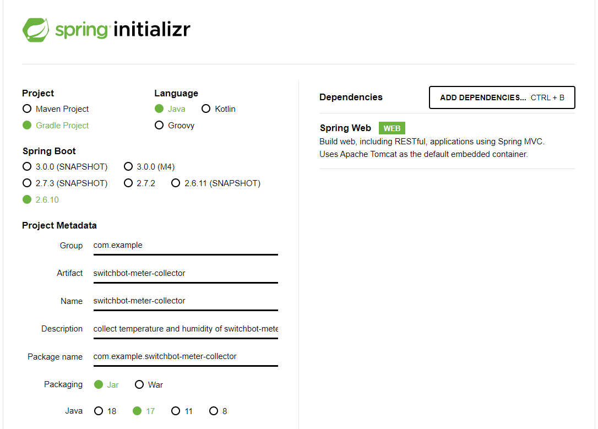

# switchbot-meter-collector

## 概要

SwitchBot温湿度計で取得した温度と湿度を収集するWebアプリケーション。

## 開発環境

- 開発言語: Java 17
- フレームワーク: Spring Boot 2.6.10
- ビルドシステム: Gradle

プロジェクトの雛型作成に使用したSpring Initializrの設定。


### プログラム構成

RestControllerを作成し、Web APIのエンドポイントを登録。  
温湿度情報を保持するモデルを作成。  
登録した情報の永続化はしていなく、アプリケーションの再起動で情報は削除される。

### ビルド

```
$ ./gradlew build
```

### 実行

```
$ ./gradlew bootRun
```

## 機能

### 温湿度の登録

Web APIのPOSTリクエスト発行(/meter)で温湿度を登録。

```
$ curl -X POST -d "exec_time=2022-07-30 10:30:00&device_name=south_room&temperature=28.0&humidity=57" http://localhost:8080/meter
add meter
```

### 登録した温湿度の取得

Web APIのGETリクエスト(/meter)で登録した温湿度を取得。

```
$ curl -X GET http://localhost:8080/meter
Meter[id=095694ca, exec_time=2022-07-30 10:30:00, device_name=south_room, temperature=28.0, humidity=57]
```

## コンテナ化してGoogle Kubernetes Engineへデプロイ

Webアプリケーションをコンテナ化してGoogle Kubernetes Engine(GKE)にデプロイする。

以降の操作は、Google Cloud Shell上で実行する。

### コンテナイメージの作成

open-jdk-17をインストール。
```
$ sudo apt-get update
$ sudo apt install openjdk-17-jdk
$ export JAVA_HOME=/usr/lib/jvm/java-17-openjdk-amd64
```

dockerコンテナは、Cloud Buildを使用して作成し、イメージはContainer Registryに保存する。

Cloud Build APIを有効化。
```
$ gcloud services enable cloudbuild.googleapis.com
```

Webアプリケーションのソースリポジトリを取得。
```
$ git clone https://github.com/kokano731/switchbot-meter-collector.git
$ cd switchbot-meter-collector/
```

ビルドしてイメージをContainer Registryに登録。
```
$ gcloud builds submit --tag gcr.io/${GOOGLE_CLOUD_PROJECT}/switchbot-meter-collector:0.1 .
```

### GKEクラスタの作成

デフォルトのコンピューティングゾーンを設定。
```
$ gcloud config set compute/zone us-central1-a
```

Container Registry APIを有効化。
```
$ gcloud services enable container.googleapis.com
```

GKEクラスタを作成。
```
$ gcloud container clusters create my-cluster
```

クラスタの認証情報を取得。
```
$ gcloud container clusters get-credentials my-cluster
```

Webアプリケーションをクラスタにデプロイ。
```
$ kubectl create deployment switchbot-meter-collector --image=gcr.io/${GOOGLE_CLOUD_PROJECT}/switchbot-meter-collector:0.1
```

ポートを公開して外部アクセス可能とする。
```
$ kubectl expose deployment switchbot-meter-collector --type=LoadBalancer --port 8080
```

サービスの情報を確認。
```
$ kubectl get service
NAME                        TYPE           CLUSTER-IP   EXTERNAL-IP     PORT(S)          AGE
kubernetes                  ClusterIP      10.104.0.1   <none>          443/TCP          5m43s
switchbot-meter-collector   LoadBalancer   10.104.2.8   34.71.217.176   8080:30486/TCP   44s
```

上で確認した外部IPアドレスに対してWeb APIを発行。

温湿度を登録。
```
$ curl -X POST -d "exec_time=2022-07-30 10:30:00&device_name=south_room&temperature=28.0&humidity=57" http://34.71.217.176:8080/meter
add meter
```

登録した温湿度を確認。
```
$ curl http://34.71.217.176:8080/meter
Meter[id=de2b957d, exec_time=2022-07-30 10:30:00, device_name=south_room, temperature=28.0, humidity=57]
```

クラスタを削除して稼働を停止。
```
$ gcloud container clusters delete my-cluster
```

## 参考

- Kubernetes Engine: Qwik Start  
https://www.cloudskillsboost.google/focuses/878?parent=catalog

- Google Kubernetes Engine でのウェブサイトのデプロイ、スケーリング、更新  
https://www.cloudskillsboost.google/focuses/10470?locale=ja&parent=catalog

- Java開発 for Kubernetes  
https://techbookfest.org/product/6720035865231360?productVariantID=5506945739915264
